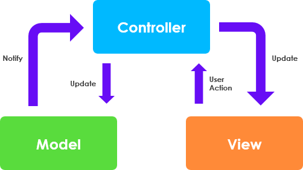

# Dokumentation 
Dette er min egen dokumentation af Java Webstack. 
Vi skal lave et intratnet og vil bruge denne 
dokumentation til bedre at kunne huske 
hvad vi lavede. 

## Start af et nyt webprojekt

1. Opret nyt projekt i IntelliJ
2. Vælg JavaEE projektskabelon 
3. Java + Maven 
4. Servlet dependencies

## Arkitektur

Vi anvender en slags MVC-pattern

- M(odel) - Entiteter og hjælper- metoder og klasser. Business-logic
- V(iew) - JSP og frontend (css, bootstrap mm)
- C(ontrol) - Servlets

Husk! Ingen kommunikation mellem Model og View. Gå altid igennem controlleren. 